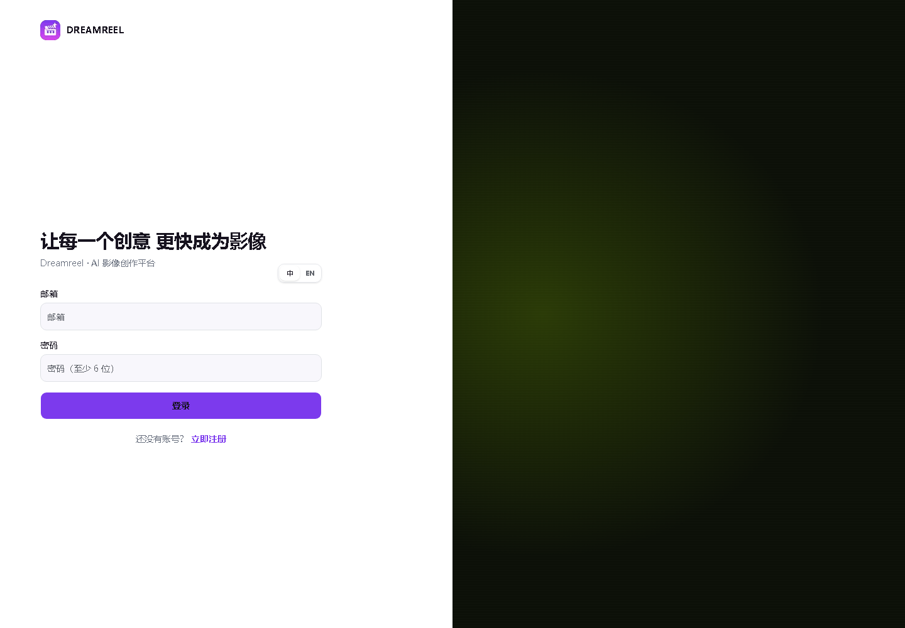
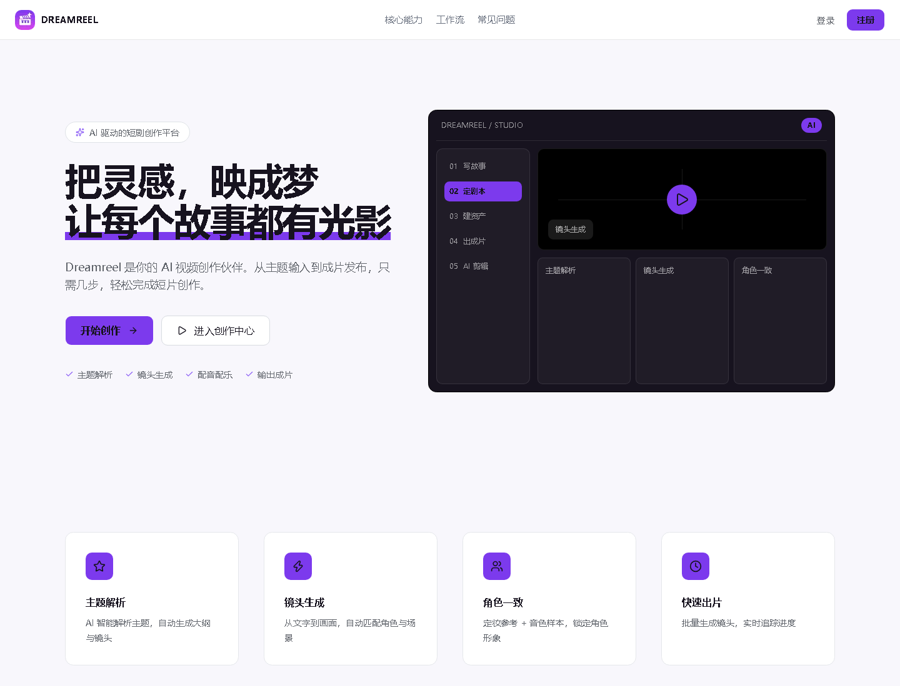

# Dreamreel · AI 短剧创作平台

> **版本**：v0.1.0 · **更新日期**：2026-07-17  
> **代码仓库**：https://github.com/fuhanhao/Dreamreel-

Dreamreel 是一站式 AI 短剧 SaaS 平台，面向业务用户提供**创作中心、项目管理、短剧生产流水线（DramaForge）、无限画布工作流**等能力，支持通过 TokenFree 与火山方舟 Seedance 调用文生图、文生视频、图生视频等模型。

---

## 目录

- [1. 产品简介](#1-产品简介)
- [2. 系统架构](#2-系统架构)
- [3. 环境要求](#3-环境要求)
- [4. 本地开发启动](#4-本地开发启动)
- [5. Docker 部署](#5-docker-部署)
- [6. AI 模型 API 配置](#6-ai-模型-api-配置)
- [7. 功能模块说明](#7-功能模块说明)
- [8. 典型业务流程](#8-典型业务流程)
- [9. 系统管理](#9-系统管理)
- [10. 日常运维](#10-日常运维)
- [11. 常见问题](#11-常见问题)
- [附录](#附录)

---

## 1. 产品简介

| 项目 | 说明 |
|------|------|
| 产品名称 | **Dreamreel**（前端展示名） |
| 后端服务名 | `dreamreel-api` |
| 适用场景 | AI 短剧策划、分镜、资产生成、镜头视频、合成导出 |
| 访问方式 | Web 浏览器（推荐 Chrome / Edge 最新版） |
| 界面语言 | 中文 / English（顶栏切换） |

**核心能力：**

- 创作中心：文生视频、图生视频、文生图、文本生成，统一任务列表与预览
- 项目管理：创建/编辑项目，进入短剧流水线或画布工作流
- DramaForge 流水线：剧本解析 → 资产设计 → 分镜 → 镜头视频 → 合成导出（SSE 实时进度）
- 无限画布：React Flow 节点编辑器，支持从流水线同步节点图
- 管理后台：用户、项目、生成任务统计与审计



---

## 2. 系统架构

```
┌─────────────┐     HTTP/SSE      ┌──────────────────┐
│  Web 前端    │ ◄──────────────► │  Spring Boot API │
│  Next.js    │   :7050 / :7051  │  Java 21         │
└─────────────┘                   └────────┬─────────┘
                                           │
                    ┌──────────────────────┼──────────────────────┐
                    ▼                      ▼                      ▼
             PostgreSQL 16            Redis 7              本地/OSS 媒体
               :7052                    :7053                 存储
                    │
                    ▼
        外部 AI：TokenFree（文本/图像）· 火山方舟 Seedance（视频）
```

| 模块 | 技术 |
|------|------|
| 前端 | Next.js 16、React Flow、Tailwind CSS |
| 后端 | Spring Boot 3.4、Spring Security + JWT |
| 数据库 | PostgreSQL 16 |
| 缓存 | Redis 7 |
| 容器仓库 | GitHub Container Registry `fuhanhao`（业务镜像） |

---

## 3. 环境要求

| 组件 | 版本要求 |
|------|----------|
| Node.js | ≥ 20 |
| npm | ≥ 10（随 Node 安装） |
| Java | 21 |
| Maven | 3.9+ |
| Docker | 24+（部署用） |
| Docker Compose | v2 |

---

## 4. 本地开发启动

### 4.1 端口规划

| 服务 | 端口 | 说明 |
|------|------|------|
| Web 前端 | **7050** | Next.js 开发/生产 |
| API 后端 | **7051** | REST + SSE |
| PostgreSQL | **7052** | 仅 `docker-compose.yml` 映射 |
| Redis | **7053** | 仅 `docker-compose.yml` 映射 |

### 4.2 方式一：一键启动（Windows 推荐）

```bash
# 启动 Docker + API + Web，并打开浏览器
start.bat

# 停止服务
stop.bat
```

等效命令：

```bash
npm run start:all
npm run stop:all
```

### 4.3 方式二：分步启动

**① 启动中间件**

```bash
docker compose up -d
```

**② 安装依赖（首次）**

```bash
npm install
```

**③ 配置前端**

```bash
cp apps/web/.env.local.example apps/web/.env.local
```

`.env.local` 示例：

```bash
NEXT_PUBLIC_API_URL=http://localhost:7051
```

**④ 配置后端（可选，推荐）**

```bash
cp services/api/application-local.yml.example services/api/application-local.yml
```

在 `application-local.yml` 中填写 TokenFree / 方舟 Key，或在 Web 端「API Key 设置」中配置。

**⑤ 启动 API**

```bash
npm run api:dev
# 或
cd services/api && mvn spring-boot:run -Dspring-boot.run.profiles=local
```

**⑥ 启动 Web**

```bash
npm run dev
```

### 4.4 验证安装

| 检查项 | 地址 / 命令 |
|--------|-------------|
| API 健康检查 | http://localhost:7051/api/v1/health |
| 前端首页 | http://localhost:7050 |
| 创作画布 | http://localhost:7050/studio |

```bash
curl http://localhost:7051/api/v1/health
```

期望返回 `"status":"UP"`。



---

## 5. Docker 部署

> 生产 Nginx 与 HTTPS 配置见 [deploy/nginx/dreamreel.conf](deploy/nginx/dreamreel.conf)；环境变量见 [.env.prod.example](.env.prod.example)。

项目提供多套 Compose：

| 文件 | 用途 |
|------|------|
| `docker-compose.yml` | 仅 PostgreSQL + Redis（本地开发） |
| `docker-compose.full.yml` | **全栈**：Postgres + Redis + API + Web |

### 5.1 使用镜像部署

业务镜像推送到 GitHub Container Registry，服务器可直接拉取：

| 服务 | 镜像地址 |
|------|----------|
| API | `ghcr.io/fuhanhao/dreamreel-api:latest` |
| Web | `ghcr.io/fuhanhao/dreamreel-web:latest` |

```bash
# 1. 克隆代码
git clone https://github.com/fuhanhao/Dreamreel-.git
cd Dreamreel-

# 2. 准备环境变量（生产务必修改 JWT_SECRET 与数据库密码）
export JWT_SECRET=your-production-jwt-secret-at-least-32-chars
export TOKENFREE_API_KEY=sk-your-tokenfree-key
export ARK_API_KEY=your-ark-seedance-key
export API_BASE_URL=
export IMAGE_TAG=latest

# 3. 拉取并启动
docker compose -f docker-compose.full.yml pull
docker compose -f docker-compose.full.yml up -d

# 4. 查看状态
docker compose -f docker-compose.full.yml ps
```

访问：

- 前端：http://服务器:7050  
- API：http://服务器:7051/api/v1/health  

> **说明**：`docker-compose.full.yml` 中 `api` / `web` 的 `image` 已指向 GHCR；本地仍保留 `build:` 段，便于开发机构建后推送。

### 5.2 本地构建镜像（可选）

```bash
docker compose -f docker-compose.full.yml build api web
docker compose -f docker-compose.full.yml up -d
```

构建 Web 时可选传入 `NEXT_PUBLIC_API_URL`（本地开发默认值）；生产环境优先使用运行时 `API_BASE_URL`。

### 5.3 生产部署（Nginx + HTTPS）

生产环境推荐使用 `docker-compose.prod.yml`：Web/API 仅绑定 `127.0.0.1`，由宿主机 Nginx 反代并终止 TLS。

| 文件 | 说明 |
|------|------|
| `docker-compose.prod.yml` | 生产 Compose（Postgres + Redis + API + Web） |
| `deploy/nginx/dreamreel.conf` | 宿主机 Nginx：`/` → Web，`/api/v1/` → API |
| `.env.prod.example` | 生产环境变量模板 |

```bash
# 服务器上
cp .env.prod.example .env.prod   # 填写 JWT、AI Key、数据库密码等
docker compose -f docker-compose.prod.yml pull
docker compose -f docker-compose.prod.yml up -d
```

**前端 API 地址**：通过 Web 容器环境变量 `API_BASE_URL` 注入（见 `apps/web/docker-entrypoint.sh`）。  
留空表示浏览器走同源 `/api/v1`（需 Nginx 反代）；修改后 `docker compose restart web` 即可，**无需重建镜像**。

数据库同步（本地 → 生产）：

```bash
python scripts/sync_db_remote.py
```

### 5.4 数据持久化

| 卷名 | 内容 |
|------|------|
| `postgres_data` | 数据库 |
| `redis_data` | 缓存 |
| `api_media` | 生成媒体文件 |
| `api_uploads` | 用户上传文件 |

---

## 6. AI 模型 API 配置

本平台不依赖外部文档平台 API，而是通过 **TokenFree**（文本/图像）与 **火山方舟 Seedance**（视频）调用模型。Key 可在前端设置，也可通过服务端环境变量提供回退。

### 6.1 TokenFree（文本 / 图像）

| 配置项 | 说明 |
|--------|------|
| 控制台 | https://www.tokenfree.com |
| 环境变量 | `TOKENFREE_API_KEY` |
| 前端 Header | `X-Tokenfree-Api-Key` |
| 默认 Base URL | `https://www.tokenfree.com`（配置中**不要**加 `/v1` 后缀） |

服务端默认模型（可在 `application.yml` 覆盖）：

| 用途 | 默认模型 |
|------|----------|
| 对话/剧本 | `qwen-max` |
| 文生图 | `nano-banana-2` |
| 图编辑 | `nano-banana-2` |

**配置方式（任选其一）：**

```bash
# 方式一：后端环境变量
export TOKENFREE_API_KEY=sk-your-tokenfree-api-key

# 方式二：application-local.yml
# services/api/application-local.yml → dreamreel.tokenfree.api-key

# 方式三：Web 端「API Key 设置」（存浏览器 localStorage，请求时随 Header 发送）
```

### 6.2 火山方舟 Seedance（视频）

| 配置项 | 说明 |
|--------|------|
| 控制台 | 火山方舟 / Seedance 控制台 |
| 环境变量 | `ARK_API_KEY` |
| 前端 Header | `X-Ark-Api-Key` |
| 默认 Base URL | `https://ark.cn-beijing.volces.com` |

默认视频模型：`doubao-seedance-2-0-260128`

### 6.3 豆包语音（可选，角色音色）

用于 DramaForge 角色音色样本，需在 `application-local.yml` 配置：

```yaml
dreamreel:
  speech:
    app-id: "your-app-id"
    access-key: your-access-token
    secret-key: your-secret-key
```

### 6.4 验证 AI 连通性

1. 登录 Web → 打开「API Key 设置」填写 Key  
2. 在创作中心发起一次文生图或文生视频  
3. 或在 DramaForge 工作流中触发「资产设计」任务，观察 SSE 进度  

API 健康检查（不验证 AI Key）：

```bash
curl http://localhost:7051/api/v1/health
```

---

## 7. 功能模块说明

### 7.1 创作中心

**路径**：`/`

**功能概述**：首页可浏览，发起创作需登录。支持文生视频、图生视频、文生图、文本生成，展示最近任务卡片。

| 元素 | 说明 |
|------|------|
| API Key 设置 | 配置 TokenFree / 方舟 Key |
| 语言切换 | 顶栏「中 \| EN」 |
| 登录跳转 | 未登录点击创作 → `/login` |

### 7.2 项目管理

**路径**：`/projects`

**功能概述**：创建、编辑、删除项目；进入 DramaForge 流水线或画布工作流。

| 元素 | 说明 |
|------|------|
| 新建项目 | 填写名称与描述 |
| 进入工作流 | 跳转 `/studio/{projectId}` |
| DramaForge 入口 | `?entry=dramaforge` |

### 7.3 DramaForge 短剧流水线

**路径**：`/studio/{projectId}`（工作流视图）

**API 前缀**：`/api/v1/dramaforge/projects/{projectId}`

**功能概述**：从文学文本/剧本到成片的全链路生产，任务异步执行，前端通过 SSE 订阅 `job_progress` / `job_completed` 等事件。

| 阶段 | 说明 |
|------|------|
| 资产提取 | 从原文解析角色/场景/道具 |
| 剧本生成 | LLM 生成结构化剧本并解析镜头 |
| 资产设计 | 批量生成角色/场景/道具参考图 |
| 分镜 | 为每个镜头生成 storyboard |
| 镜头视频 | 调用 Seedance 提交视频任务 |
| 视频同步 | 轮询方舟任务状态直至完成 |
| 合成导出 | 拼接镜头、导出工程包 / 剪映草稿 |

### 7.4 无限画布

**路径**：`/studio/{id}`（画布模式）

**功能概述**：React Flow 节点编辑器，支持文本/图像/视频节点，可从 DramaForge 流水线同步节点图。

### 7.5 资源库 / 模型市场 / 社区

**路径**：`/library`、`/market`、`/community`

当前为「即将上线」占位页，后续版本开放。

### 7.6 用户认证

**路径**：`/login`、`/register`

| 接口 | 方法 | 说明 |
|------|------|------|
| `/api/v1/auth/register` | POST | 注册 |
| `/api/v1/auth/login` | POST | 登录，返回 JWT |
| `/api/v1/auth/me` | GET | 当前用户信息 |

登录态保存在浏览器，API 请求携带 `Authorization: Bearer <token>`。

---

## 8. 典型业务流程

### 8.1 快速体验：创作中心生视频

```
登录 → 配置 API Key → 选择「文生视频」→ 填写提示词 → 提交
     → 任务列表轮询/刷新 → 预览或下载结果
```

### 8.2 短剧生产：DramaForge 全流程

```
创建项目 → 进入工作流 → 上传/粘贴原文
        → 提取资产 → 生成剧本 → 批量资产设计
        → 生成分镜 → 批量/单镜生成视频 → 等待同步完成
        → 合成剧集 → 导出
```

任务由后端 `DramaForgeJobWorker` 每 5 秒调度，同一时刻仅一个 RUNNING 任务；进度与状态通过 SSE 推送。

### 8.3 画布工作流

```
进入项目画布 → 添加节点（文本/图/视频）→ 连线配置
            → 可选：从 DramaForge 同步节点图 → 保存项目 canvas JSON
```

---

## 9. 系统管理

**路径**：`/admin`（需管理员角色）

| 子页面 | 路径 | 功能 |
|--------|------|------|
| 概览 | `/admin` | 统计仪表盘 |
| 用户 | `/admin/users` | 用户列表与状态 |
| 项目 | `/admin/projects` | 全站项目 |
| 生成任务 | `/admin/generations` | 生成记录 |

**API 前缀**：`/api/v1/admin/*`

### 默认管理员账号

首次启动且 `ADMIN_AUTO_CREATE=true` 时自动创建：

| 字段 | 默认值 |
|------|--------|
| 邮箱 | `admin@dreamreel.local` |
| 密码 | `admin123456` |
| 显示名 | 系统管理员 |

> **生产环境务必**修改 `ADMIN_PASSWORD`、`ADMIN_EMAIL`，并设置强随机 `JWT_SECRET`。

> 管理后台截图待补充；当前可先访问 `/admin` 使用默认管理员账号登录体验。

---

## 10. 日常运维

### 10.1 常用命令

```bash
# 开发
npm run dev              # 前端 :7050
npm run api:dev          # 后端 :7051
npm run api:build        # 打包 API JAR

# Docker（仅中间件）
npm run docker:up
npm run docker:down

# 全栈
docker compose -f docker-compose.full.yml up -d
docker compose -f docker-compose.full.yml logs -f api
docker compose -f docker-compose.full.yml down
```

### 10.2 日志位置

| 场景 | 位置 |
|------|------|
| 本地 API | 启动终端标准输出 |
| Docker API | `docker compose -f docker-compose.full.yml logs api` |
| 媒体文件 | `./data/media`、`./data/uploads`（或容器卷 `api_media` / `api_uploads`） |

### 10.3 备份建议

- 定期备份 PostgreSQL 卷 `postgres_data`
- 备份 `api_media`、`api_uploads` 卷或本地 `data/` 目录

### 10.4 镜像重新发布

配置见 `.docker-publish.yml`，推送记录见 `.docker/镜像推送记录.md`。

---

## 11. 常见问题

| 问题 | 可能原因 | 处理建议 |
|------|----------|----------|
| 前端无法调用 API | `API_BASE_URL` / Nginx 反代未配置 | 生产留空 `API_BASE_URL` 并确保 Nginx 转发 `/api/v1/` |
| 登录报 403 | CORS 未包含生产域名 | 设置 `CORS_ALLOWED_ORIGINS=https://www.dreamreel.com,...` |
| 提示请配置 TokenFree Key | 未设置 Key | 前端 API Key 设置或环境变量 `TOKENFREE_API_KEY` |
| 视频任务一直排队 | 未配置方舟 Key 或模型未开通 | 检查 `ARK_API_KEY` 与 Seedance 控制台 |
| API 报 Hikari 连接池超时 | 批量任务并发占用连接 | 已优化事务边界；重启 API，避免同时发起过多长任务 |
| SSE 断开日志 | 浏览器关闭连接 | 正常现象，不影响服务 |
| 工作流页白屏闪一下 | 加载态样式 | 已统一暗色加载组件 |
| Docker 部署后无法登录 | JWT/数据库为新实例 | 使用默认管理员或重新注册 |

---

## 附录

### A. 环境变量速查

| 变量 | 作用 | 默认值 |
|------|------|--------|
| `API_BASE_URL` | Web 运行时 API 基址（Docker 注入） | 留空=同源 |
| `NEXT_PUBLIC_API_URL` | 本地 dev 构建时 API 基址 | `http://localhost:7051` |
| `CORS_ALLOWED_ORIGINS` | API 允许的前端 Origin | 含 localhost 与 dreamreel.com |
| `JWT_SECRET` | JWT 签名密钥 | 开发内置（**生产必改**） |
| `TOKENFREE_API_KEY` | TokenFree 服务端回退 Key | 空 |
| `ARK_API_KEY` | 方舟 Seedance 服务端回退 Key | 空 |
| `ADMIN_EMAIL` | 初始管理员邮箱 | `admin@dreamreel.local` |
| `ADMIN_PASSWORD` | 初始管理员密码 | `admin123456` |
| `IMAGE_TAG` | Docker 镜像标签 | `latest` |

数据库（`docker-compose.full.yml` 内置）：

| 变量 | 值 |
|------|-----|
| 库名 | `dreamreel` |
| 用户 | `dreamreel` |
| 密码 | `dreamreel_dev`（**生产必改**） |

### B. 镜像地址

```
ghcr.io/fuhanhao/dreamreel-api:latest
ghcr.io/fuhanhao/dreamreel-web:latest
```

中间件使用公共镜像，不推送：

```
postgres:16-alpine
redis:7-alpine
```

### C. 主要 API 路径

| 模块 | 前缀 |
|------|------|
| 健康检查 | `GET /api/v1/health` |
| 认证 | `/api/v1/auth` |
| 项目 | `/api/v1/projects` |
| 文本生成 | `/api/v1/text` |
| 图像生成 | `/api/v1/image` |
| 视频生成 | `/api/v1/video` |
| 上传 | `/api/v1/uploads` |
| 媒体 | `/api/v1/media` |
| DramaForge | `/api/v1/dramaforge/projects/{id}` |
| 管理 | `/api/v1/admin` |

### D. 项目结构

```
dreamreel/
├── apps/web/                  # Next.js 前端（Dreamreel）
├── services/api/              # Spring Boot API
├── packages/shared-types/     # 共享类型
├── docker-compose.yml         # 开发：Postgres + Redis
├── docker-compose.full.yml    # 部署：全栈镜像
├── docker-compose.prod.yml    # 生产：Nginx 反代 + 127.0.0.1
├── deploy/nginx/dreamreel.conf
├── .env.prod.example
├── start.bat / stop.bat       # Windows 一键启停
└── scripts/start-all.ps1      # 启停脚本
```

### E. 截图索引

| 文件名 | 说明 |
|--------|------|
| `docs/images/dreamreel-login.png` | 登录页 |
| `docs/images/dreamreel-home.png` | 创作中心首页 |

---

**Dreamreel** · AI 短剧创作平台 · v0.1.0 · 2026-07-17
