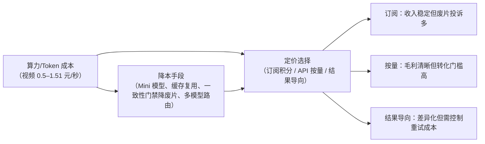

# 映梦 Dreamreel 市场分析报告

## 文档信息表

| 项目 | 内容 |
| --- | --- |
| 产品/行业 | 映梦 Dreamreel —— AI 短剧/漫剧创作平台（微短剧 + AI 视频生成行业） |
| 文档版本 | V0.1（草稿） |
| 日期 | 2026-08-21 |
| 分析范围 | 中国微短剧/AI 剧漫剧市场为主，海外短剧与全球 AI 视频生成器为辅；覆盖价值链上下游成本 |
| 文档状态 | 待评审 |

---

## 0 摘要

1. **母市场已过千亿**：广电总局口径，2025 年微短剧市场规模破千亿元（较 2024 年翻番），3.3 万部上线、国内用户近 7 亿；艾媒口径 2025 年预测 677.9 亿元，2030 年有望超 1500 亿元（口径差异详见 2.2）。
2. **AI 剧漫剧是当前最陡峭的细分赛道**：行业媒体估算 2025 年国内 AI 漫剧约 168 亿元，2026 年预计 240 亿元；DataEye 预估 2026 年 AI 剧漫剧市场规模有望超 400 亿元，活跃从业者超 50 万人。
3. **技术处于「单镜头生成 → 创作平台/长叙事流水线」的过渡期**：长视频（30 秒原生直出）与音画同步已量产，但「角色一致性」仍是社区公认最崩坏的部分，编排层（剧本→资产→分镜→成片）无主流产品完整闭环。
4. **用户付费动机明确且已被验证**：可灵 2026Q2 单季营收超 8.5 亿元、全球用户破 1 亿；创作者为「省掉人工串联劳动、保持角色一致、快速出片」付费，拒绝为排队与废片买单。
5. **机会判断**：对 Dreamreel 而言，值得做的是「以一致性门禁 + 流水线编排 + 过程可视化」切入 AI 剧漫剧创作者工具市场；不做纯模型军备竞赛，不碰未备案内容分发；关注上游模型长叙事内化与合规政策变化。

---

## 1 市场定义与范围

| 环节 | 定义 | 典型产品/玩家 | 与目标产品的关系 |
| --- | --- | --- | --- |
| 基础模型/视频生成 | 文生视频、图生视频、图像、TTS 等底层能力 | 火山方舟 Seedance/Seedream、可灵、Vidu、Runway Gen、Veo | 上游能力来源；成本与能力决定产品毛利上限 |
| AI 创作工具 | 面向创作者的生成界面、素材管理、订阅 | 即梦 AI、可灵 AI、Vidu 官网、Pika | 直接竞品（见竞品分析报告） |
| AI 短剧/漫剧编排平台 | 剧本→资产→分镜→镜头视频→合成导出的整剧流水线 | Dreamreel（DramaForge）、行业少量自研工具 | 目标产品所在环节（蓝海） |
| 内容制作与分发 | 成片、漫剧、短剧账号运营与平台分发 | 抖音、快手、B 站、红果短剧等 | 下游出口；决定内容合规要求 |
| 商业化服务 | 广告、付费解锁、分账、版权、出海 | 巨量星图、短剧出海平台 | 用户付费动机的来源 |

### 1.1 上下游与成本现状（必须）

| 环节 | 关键供应商 | 价格/成本现状 | 对目标产品的成本含义 |
| --- | --- | --- | --- |
| 视频生成（API） | 火山方舟 Seedance | 720P 约 1.51 元/秒（2.5 版）；Seedance 2.0 Mini 约 0.5 元/秒 | 单集 90 秒素材的视频成本约 45–136 元，叠加重试倍率后可承受 |
| 视频生成（订阅） | 可灵 AI | 黄金 66 → 黑金 1314 元/月 | 个人创作者价格敏感度极高，需按结果/额度设计 |
| 图像生成 | 火山方舟 Seedream、即梦 | 随会员积分计费，价格持续下降 | 资产定妆图成本占比低于视频，可批量生成 |
| TTS/配音 | 火山 TTS、各平台内置 | 订阅内包含或按量计费 | 成本占比低，可作为增值服务 |
| 分发平台 | 抖音、快手、B 站、红果 | 分成/投流成本由内容方承担 | 内容侧商业化（分账/广告）是创作者付费的根基 |

**为什么现在能做**：上游视频生成成本在一年内下降约 50%（Seedance 2.0 Mini 对标标准版），长视频与音画同步已量产；下游付费意愿已被可灵/即梦验证。编排层（DramaForge 这类流水线）仍无主流产品占据，属于「上游降价、下游付费、中间空白」的窗口期。

---

## 2 市场规模

### 2.1 母市场（上下文）

| 市场 | 规模 | 增长 | 用户规模 | 来源 |
| --- | --- | --- | --- | --- |
| 中国微短剧 | 2025 年破千亿元 | 较 2024 年翻番 | 近 7 亿 | 广电总局 2026.02 |
| 中国微短剧（艾媒口径） | 2025E 677.9 亿元 | +34.4% | 6.62 亿（2024.12） | iiMedia 2025.09 |
| 海外短剧 | 2025 年收入 23.29 亿美元 | +133% | 下载 11.99 亿次（+268%） | 中国网络视听大会报告 2026.04 |
| 全球 AI 视频生成器 | 2025 年 7.17 亿美元 | CAGR 约 18.8% | — | Fortune Business Insights 2026.01 |

### 2.2 多机构口径对比

| 机构 | 口径 | 当前值 | 预测 | CAGR | 备注 |
| --- | --- | --- | --- | --- | --- |
| 广电总局 2026.02 | 微短剧市场规模（含上线播出、用户付费、广告等整体） | 2025 破千亿 | 将制定《微短剧发展管理办法》 | — | 官方口径，含行业整体 |
| iiMedia 2025.09 | 中国网络微短剧市场规模 | 2025E 677.9 亿元 | 2030E 超 1500 亿元 | 约 17% | 2025 年发布时的预测值，范围偏「网络微短剧核心收入」 |
| DataEye 2026.08 | 国内 AI 剧漫剧市场规模 | 2026E 超 400 亿元 | — | 同比 +138% | 含 AI 剧/漫剧内容与创作经济，口径更窄、增速更陡 |
| 行业媒体估算 2026.05 | 国内 AI 漫剧市场规模 | 2025 约 168 亿元，2026E 240 亿元 | — | — | 非官方，仅作方向参考 |
| Fortune Business Insights 2026.01 | 全球 AI 视频生成器（工具市场） | 2025 7.17 亿美元，2026 8.47 亿美元 | 2034 33.5 亿美元 | 18.8% | 工具订阅/API 口径，不含内容收入 |
| 中邮证券引 Precedence Research 2026.06 | 全球 AI 视频生成市场 | 2026 约 2.96 亿美元 | 2034 33.32 亿美元 | — | 与 Fortune 口径存在显著差异，说明该市场统计边界不统一 |

**口径差异说明**：广电总局「破千亿」为官方整体口径（含投流、广告、付费等）；艾媒 677.9 亿元为 2025 年中发布的预测值，统计范围偏「网络微短剧核心收入」；DataEye 的「AI 剧漫剧」仅统计 AI 生成内容部分。三个口径不冲突，分别代表「行业大盘 / 微短剧核心 / AI 渗透细分」。

### 2.3 区域口径（中国）

| 数据 | 数值 | 来源 |
| --- | --- | --- |
| 2025 年上线微短剧部数 | 3.3 万部 | 广电总局 2026.02 |
| 国内微短剧用户 | 近 7 亿 | 广电总局 2026.02 |
| 微短剧用户规模（2024.12） | 6.62 亿 | iiMedia 2025.09 |
| AI 剧漫剧活跃从业者/个人创作者 | 超 50 万人 | DataEye 2026.08 |
| AI 剧漫剧相关日 Token 消耗 | 破 7000 万 | 行业媒体 2026.05 |

### 2.4 细分环节估算（尽量拉竞品/具体产品数据）

| 环节 | 规模估算 | 说明 |
| --- | --- | --- |
| AI 视频创作工具收入 | 可灵 2026Q2 单季超 8.5 亿元（同比 +200%）；机构预测可灵 2026 年约 35 亿元 | 头部单产品已跑通商业模式 |
| AI 漫剧内容市场 | 2025 约 168 亿元 → 2026E 240 亿元 | 行业媒体估算，AI 生成内容占比快速上升 |
| 海外短剧 | 2025 收入 23.29 亿美元、下载 11.99 亿次 | 出海是 AI 短剧的增量出口 |
| AI 创作者付费基数 | 即梦 2026Q1 月活 1352.5 万、下载 558.9 万 | 工具侧用户基数已足够大 |

### 2.5 TAM/SAM/SOM（产品侧估算）

| 层级 | 定义 | 估算 | 依据 |
| --- | --- | --- | --- |
| TAM | 中国微短剧内容+创作市场（理论总盘子） | 千亿元/年（2025 起） | 广电总局 2026.02 官方口径 |
| SAM | AI 剧漫剧可服务市场（工具+内容） | 240–400 亿元/年（2026E） | 行业媒体 2026.05 + DataEye 2026.08 |
| SOM | Dreamreel 首年可获取市场（工具订阅口径） | 约 2,400 万–5,000 万元 | 2–4 万付费创作者 × 人均年付费约 1,200 元；另加约 200 家工作室/企业 × 1–2 万元/年（本项为产品侧估算，非第三方数据） |

---

## 3 技术发展阶段

### 3.1 阶段框架

### 3.2 成熟度矩阵

| 环节 | 成熟度 | 代表事实 |
| --- | --- | --- |
| 文生视频 | 高 | Seedance、可灵、Vidu 均已量产并商业化（可灵单季营收 8.5 亿+） |
| 图生视频 | 高 | 可灵图生视频口碑最好；Seedance 支持设计图直出 |
| 长视频/长叙事 | 中 | Seedance 2.5 原生直出 30 秒（2026.07 全量上线）；Vidu Q3 支持 16 秒 |
| 音画同步/对口型 | 中 | Seedance 2.0 音画同步；可灵 2.6 音画同出；Dreamreel 内置 TTS+对口型+混音 |
| 角色一致性 | 中低 | 社区共识「最崩坏的部分」；Kling 被称最接近但 not perfect |
| 剧本→资产→分镜→成片编排 | 低 | 主流工具均以单镜头生成为主，无完整闭环（Dreamreel 的机会点） |
| 导出/剪辑联动 | 中低 | 即梦可联动剪映；Dreamreel 已支持导出剪映工程 |

### 3.3 当前阶段判断

行业处于**阶段 2 → 阶段 3 的过渡期**：单镜头生成已高度成熟并充分商业化，长叙事（30 秒）、音画同步等「阶段 3 能力」刚刚量产；但角色一致性与整剧编排仍是空白。Dreamreel 的 DramaForge 属于阶段 3 的编排层落地，不依赖模型军备竞赛，而是把已成熟的单镜头能力组装成「做剧」流水线。

### 3.4 可行性验证（产品是否已落地）

| 技术 | 已落地的代表产品 | 落地性结论 |
| --- | --- | --- |
| 文生视频/图生视频 | 即梦、可灵、Vidu、Runway | 已量产，可直接通过 API/订阅接入 |
| 长叙事 30 秒原生 | Seedance 2.5 | 已全量上线，编排层可直接消费 |
| 音画同步 | Seedance 2.0、可灵 2.6 | 已量产，作为上游能力接入 |
| TTS/配音 | 火山 TTS 等 | 成熟，成本低 |
| 角色一致性 | 无产品完全解决 | 用「资产定妆 + 参考图绑定 + 一致性校验门禁」的产品化方式缓解 |
| 整剧编排 | Dreamreel DramaForge（自有） | 已实现六步流水线 + 版本溯源 + SSE 可视化 |

### 3.5 成本测算（时间 + 金钱）

| 技术/方案 | 单价/单次成本 | 时间成本 | 产品能否承受 |
| --- | --- | --- | --- |
| Seedance 2.5 视频 | 约 1.51 元/秒（720P） | 生成排队分钟级–小时级 | 单镜头素材 10–30 元可承受 |
| Seedance 2.0 Mini | 约 0.5 元/秒（720P） | 同上 | 更优，适合高频试错 |
| Vidu（订阅） | 约 0.42 元/秒（旗舰版实测） | 分钟级 | 可承受 |
| 一部 60 集×90 秒 AI 短剧（视频成本） | 标准模型约 8,100 元；Mini 约 2,700 元（不含重试） | 数天–数周 | 对比真人短剧数十万–数百万元制作成本，低 1–2 个数量级 |
| 重试/废片倍率 | 按 2–3 倍计算，整剧视频成本约 1–3 万元 | — | 需要「一致性门禁 + 失败可重试」来压废片率 |

### 3.6 关键技术趋势

| 趋势 | 现状 | 对产品的影响 |
| --- | --- | --- |
| 视频单价持续下降 | Seedance 2.0 Mini 较标准版降约 50% | 毛利空间扩大，订阅定价更从容 |
| 长叙事内化 | Seedance 2.5 原生 30 秒 | 编排层仍需做「多镜头一致性」，但单镜长镜头场景被上游吃掉一部分 |
| 音画同步 | 模型直接输出同步音频 | TTS/混音层价值下降，需向上游能力靠拢或做精修增值 |
| 多模态参考 | 图/视频参考成为一致性主流方案 | 资产定妆图 + 参考图绑定是当前最现实的方案 |
| 智能体化操作 | 对话式 Agent 出现 | Dreamreel 的 Agent 动作协议（JSON actions）符合方向 |

### 3.7 前沿时间线

| 时间 | 事件 | 意义 |
| --- | --- | --- |
| 2025.02 | 广电总局发布微短剧分类分层审核通知 | 内容合规门槛确立 |
| 2025.09 | 《人工智能生成合成内容标识办法》施行 | AI 内容必须标识，工具需内置合规能力 |
| 2026.02 | Seedance 2.0 发布，主打音画同步与多模态参考 | 单镜头能力进入下一阶段 |
| 2026.04 | 即梦会员涨价、折扣调整 | 创作者成本敏感度上升，出现「被压成夹心饼干」的声音 |
| 2026.06 | Seedance 2.0 Mini 上线，720P 约 0.5 元/秒 | 上游成本腰斩，窗口期打开 |
| 2026.07 | Seedance 2.5 全量上线，原生直出 30 秒 | 长叙事量产 |
| 2026.08 | 可灵 2026Q2 单季营收超 8.5 亿元、全球用户破 1 亿 | 工具侧商业模式验证 |
| 2026.08 | AI 短剧女主「方桃子」60 秒+ 广告报价 25.8 万元 | AI 内容商业价值获市场确认 |

---

## 4 主要用户群体

### 4.1 供给侧（创作者/开发者/厂商）

| 群体 | 规模信号 | 核心需求 | 为什么付费（付费动机） |
| --- | --- | --- | --- |
| 个人创作者 | AI 剧漫剧从业者超 50 万（DataEye 2026.08） | 快速出片、角色一致、成本可控 | 省掉跨工具串联劳动；避免废片浪费积分；追热点变现 |
| MCN/短剧工作室 | 头部账号单条千万播放（新榜 2025.09） | 批量做剧、版本管理、导出精剪 | 流水线提效直接转化为产能与收入 |
| 网文作者/IP 方 | 微短剧 3.3 万部上线（广电总局 2026.02） | 原文一键转剧本/分镜 | 把文字 IP 低成本变成可分发内容 |
| 品牌/广告团队 | AI 短剧女主 60 秒+ 报价 25.8 万元（光明网 2026.08） | 品牌短剧、AI 代言人、合规 | 广告预算转投 AI 内容，成本远低于真人网红 |
| 出海团队 | 海外短剧收入 23.29 亿美元（2026.04 报告） | 多语言、多市场、合规标识 | 海外市场付费率高，ROI 明确 |

### 4.2 需求侧（消费者/玩家）

| 群体 | 特征 | 需求场景 | 为什么付费 |
| --- | --- | --- | --- |
| 微短剧观众 | 近 7 亿（广电总局 2026.02） | 碎片化追剧、付费解锁 | 单集解锁、包月会员、打赏 |
| AI 漫剧观众 | 约 1.2 亿（2025）→ 2.8 亿（2026E，行业媒体估算） | 追更、二创、社群讨论 | 包月解锁（如圆桌动漫 4.5 万人付费、18 元包月） |
| 品牌广告主 | 在抖音/快手投放 | AI 代言人、信息流素材 | 报价低于真人网红仍有传播势能 |

### 4.3 行为趋势

| 数据点 | 含义 |
| --- | --- |
| 即梦 2026Q1 月活 1352.5 万、可灵全球用户破 1 亿 | 工具渗透率已足够高，竞争转向「留存与转化」 |
| 可灵 2026Q2 单季营收超 8.5 亿元 | 创作者从免费试用到付费的转化已被头部验证 |
| AI 剧漫剧相关日 Token 消耗破 7000 万 | 供给侧产能高速扩张，工具使用深度在加深 |
| 头部 AI 动画短片全网播放破千万、AI 短剧女主广告报价超百万粉真人网红 | AI 内容商业价值得到市场确认，付费链路由 C 端延伸到 B 端 |

---

## 5 商业化模式

### 5.1 工具/平台侧

| 模式 | 机制 | 代表案例 | 优点 | 缺点 |
| --- | --- | --- | --- | --- |
| 免费额度 + 订阅积分 | 免费日额度引流，会员按档位送积分 | 可灵（66–1314 元/月）、即梦（329–2599 元/年）、Vidu（约 0.42 元/秒） | 门槛低、现金流转正快 | 用户抱怨积分坑、废片扣费、「大冤种」口碑 |
| API 按量计费 | 模型能力开放给开发者/企业 | 火山方舟 Seedance（0.5–1.51 元/秒）、Vidu（腾讯云 TokenHub） | 毛利清晰、可程序化接入 | 需要开发者客户，服务成本高 |
| 企业版/商业授权 | 无水印、商用授权、多账号 | 可灵企业客户近 5 万家 | B 端 ARPU 高、留存稳 | 需要销售与售后体系 |
| 生态导流 | 工具内嵌分发/模板导流 | 即梦联动剪映/抖音生态 | 留存与转化闭环 | 依赖巨头生态，独立性弱 |

### 5.2 内容/产品侧

| 模式 | 机制 | 代表案例 | 现状与争议 |
| --- | --- | --- | --- |
| 平台分账/版权采买 | 内容方按播放/分账规则分成 | 微短剧 3.3 万部上线（广电总局 2026.02） | 竞争激烈，头部集中 |
| 广告植入 | AI 角色接商单 | 方桃子 60 秒+ 报价 25.8 万元（2026.08） | 讨论度高，但「商业化带货为时尚早」的声音存在 |
| 付费解锁 | 单集/包月解锁 | 圆桌动漫 4.5 万人付费、18 元包月（2025.10） | 验证了 C 端付费，但依赖内容质量 |
| 出海授权 | 多语言/多市场分发 | 海外短剧 2025 收入 23.29 亿美元（2026.04） | 增量市场，合规与本地化成本高 |

### 5.3 成本结构对商业模式的影响

### 5.4 商业化结论

工具侧最优组合是「**订阅（创作者现金流）+ 算力包/API（弹性收入）+ 企业版（高 ARPU）**」：头部竞品已验证订阅可行，但「废片扣费」口碑差，因此结果导向的额度设计是差异化空间。内容侧短期不做自营分发（合规与投流成本高），通过「导出剪映工程/多平台就绪」让创作者自己去变现，中长期再考虑出海与 IP 服务抽成。

---

## 6 竞争格局

> 本报告默认不设独立竞争章节：直接竞品的逐项拆解见《映梦 Dreamreel 竞品分析报告》（docs/competitive-analysis.md）。本节仅给出与市场相关的结论性信号：即梦/可灵两强格局已形成（即梦 2026Q1 月活 1352.5 万、可灵全球用户破 1 亿），Vidu 等第二梯队以模型差异化生存；巨头生态（即梦+剪映/抖音、可灵+快手）是编排层产品最主要的挤压来源。

---

## 7 风险与合规

| 风险 | 说明 | 影响面 | 缓解 |
| --- | --- | --- | --- |
| 成本波动 | 上游 Token/算力价格战与涨价并存；巨头补贴可随时改变比价 | 毛利、定价 | 多模型路由 + Mini 模型降本；按结果计费对冲废片成本 |
| 质量风险 | 角色一致性、物理规律、文字渲染仍不稳 | 留存、口碑 | 一致性校验门禁、失败可重试、版本回溯 |
| 信任风险 | AI 内容泛滥、低质内容被平台整治（如「水果 AI 短剧」事件） | 品类信任、B 端合作 | 内置 AI 标识、质量门禁、不做低俗题材 |
| 版权/合规 | AI 标识办法（2025.09.01 施行）、微短剧分类分层审核与备案（2025.02 起） | 分发、上架 | 导出/发布前合规检查清单、备案号与标识能力预留 |
| 竞争风险 | 字节/快手生态碾压，模型能力内化编排 | 份额、定价权 | 专注「做剧流水线」的编排深度与多模型中立性 |
| 技术代际切换 | 世界模型/智能体自主制片可能跳过编排层 | 产品存在价值 | 保持模型抽象层，Agent 化能力持续演进 |
| 数据安全 | 用户素材、API Key、剧本 IP 泄露 | 信任、法律 | Key 脱敏存储、素材权限隔离、日志审计 |

---

## 8 结论与机会判断

### 8.1 结论（≤4 条）

1. 微短剧母市场千亿级、用户近 7 亿，AI 剧漫剧细分 2026E 约 240–400 亿元且增速最陡，是真实且仍在扩张的赛道。
2. 上游视频成本一年内下降约 50%，长叙事与音画同步已量产；技术处于「单镜头生成 → 创作平台/长叙事流水线」过渡期，编排层空白。
3. 付费动机已被验证：可灵单季 8.5 亿元营收、创作者超 50 万人；但用户拒绝为排队、黑盒与废片买单，这正好是产品化机会。
4. 合规（AI 标识 + 微短剧备案）成为硬门槛，早内置合规能力的产品将获得 B 端信任红利。

### 8.2 机会判断（每条落到成本与收益）

| 判断 | 依据 |
| --- | --- |
| 值得做：AI 短剧编排流水线（DramaForge） | 上游成本 0.5–1.51 元/秒可承受；创作者为「省串联劳动」付费的意愿已被可灵/即梦验证；编排层无主流产品 |
| 怎么做：一致性门禁 + SSE 可视化 + 版本溯源 + 剪映导出 | 直接回应社区三大痛点（角色不一致、黑盒、废片扣费），留存与转化双收益 |
| 不做什么：不参与模型军备竞赛、不自营内容分发 | 模型层巨头碾压不可正面竞争；自营分发需备案/投流/审核能力，超出当前资源 |
| 关注信号 | 上游模型是否把长叙事+一致性内化（威胁编排价值）；即梦/可灵是否跟进整剧编排；合规政策细则（备案号标注、AI 标识粒度） |

---

## 附录：数据来源与免责说明

> 正文中的来源均以「机构 + 年份」标注，具体链接统一收敛于本附录。所有数据为公开来源摘要，存在口径差异；估算值均显式标注；能力描述以 Dreamreel 源码与已验证功能为准，未验证能力不视为已交付；弱来源（无链接或不可核实）已剔除。

**市场规模**
- 国家广电总局（2026.02，2025 年微短剧市场规模破千亿元、3.3 万部上线、国内用户近 7 亿，较 2024 年翻番）：https://news.china.com.cn/2026-02/06/content_118321590.shtml ；https://finance.sina.com.cn/jjxw/2026-02-06/doc-inhkwsrz7978258.shtml
- iiMedia 艾媒咨询《2025-2029 年中国微短剧市场研究报告》（2025.09，2025E 677.9 亿元 / +34.4%，2030E 超 1500 亿元；2024.12 用户 6.62 亿、市场规模 505 亿元）：https://caifuhao.eastmoney.com/news/20250904182807039823690 ；https://www.thepaper.cn/newsDetail_forward_31594086
- DataEye 研究院（2026.08，2026 年国内 AI 剧漫剧市场规模有望超 400 亿元 / +138%，活跃从业者超 50 万人）：https://m.mp.oeeee.com/oe/BAAFRD0000202608111641987.html
- 行业媒体估算（2026.05，2025 年国内 AI 漫剧约 168 亿元、2026E 240 亿元、用户 1.2 亿→2.8 亿）：https://app.ruyigansu.com/print.php?contentid=32867
- 《2025 海外短剧行业报告（全年度）》（2026.04，2025 年海外短剧下载 11.99 亿次 / +268%、收入 23.29 亿美元 / +133%、活跃市场 37→46 个）：http://www.zqrb.cn/finance/hangyedongtai/2026-04-17/A1776392674080.html ；https://m.thepaper.cn/newsDetail_forward_32993476
- Fortune Business Insights《AI Video Generator Market》（2026.01，2025 年全球 AI 视频生成器市场 7.168 亿美元，2034 年 33.5 亿美元，CAGR 18.8%）：https://www.fortunebusinessinsights.com/zh/ai-video-generator-market-110060
- 中邮证券引 Precedence Research（2026.06，2026 年约 2.96 亿美元、2034 年 33.32 亿美元）：https://epaper.tkww.hk/a/202606/24/AP6a3aeb3de4b04773b070e6ef.html

**技术与前沿**
- 火山引擎 Seedance 2.5 定价（2026.07，720P 约 1.51 元/秒、单段最长 30 秒）：https://www.aitop100.cn/infomation/details/34378.html
- 火山引擎 Seedance 2.0 Mini（2026.06，720P 单秒约 0.5 元，图生视频 0.023 元/千 tokens）：https://awtmt.com/articles/3774800 ；http://w.dzwww.com/sjb/index.php?c=ad&a=show&id=p3GGKdNX8G7
- Vidu 价格实测（2026，旗舰版 6710 元/年、8000 积分/月、约 0.42 元/秒）：https://voice.newrank.cn/study/hot/CA22D5C5433A9F69
- 可灵会员价格（2026.06，黄金 66 / 铂金 266 / 钻石 666 / 黑金 1314 元/月）：https://m.toutiao.com/article/7647083861825962502/
- 即梦会员调价（2026.04，659/1899/5199 元/年 → 六折 329/949/2599 元/年）：https://m.thepaper.cn/newsDetail_forward_32940440
- Runway 定价（2026.05，Standard 12–15 美元/月、Pro 28 美元/月、Unlimited 转 Max 95 美元/月）：https://www.versely.studio/blog/runway-gen-4-pricing-vs-alternatives-2026 ；https://help.runwayml.com/hc/en-us/articles/52068047744019-Unlimited-plan-is-switching-to-Max
- Pika 定价（2026.02，Standard 8 美元/月起，第三方汇总）：https://www.seedance2.today/blog/seedance-2-0-vs-pika-best-budget-friendly-ai-video-generator

**用户与行为**
- 可灵 AI 商业化数据（2026.08，2026Q2 单季营收超 8.5 亿元 / +200%，全球用户破 1 亿、覆盖 224 国、企业客户近 5 万家）：https://www.stcn.com/article/detail/4087810.html ；https://www.cls.cn/detail/2458759
- 即梦 AI 用户数据（2026.05，2026Q1 月活 1352.5 万、下载 558.9 万）：https://www.gansuci.cn/2026/0517/474769.shtml
- AI 短剧女主「方桃子」广告报价（2026.08，巨量星图 1–20 秒 16.8 万、21–60 秒 20.8 万、60 秒+ 25.8 万元）：https://m.gmw.cn/2026-08/07/content_38930149.htm
- 头部 AI 动画短片千万播放（2025.09，B 站/抖音获赞 56 万/48 万）：https://voice.newrank.cn/study/hot/848991D945A0DD01
- 圆桌动漫付费案例（2025.10，4.5 万人付费、18 元包月、约 80–100 万收入）：http://dianyingjie.com.cn/2025/1010/398396.shtml

**合规**
- 国家广播电视总局微短剧管理通知（2025.02，分类分层审核、未标注许可证或备案号不得上线）：http://cpc.people.com.cn/BIG5/n1/2025/0206/c64387-40413269.html ；https://m.gmw.cn/2025-02/05/content_1303962806.htm
- 《人工智能生成合成内容标识办法》（2025.09.01 施行，四部门联合发布）：http://legalinfo.moj.gov.cn/pub/sfbzhfx/zhfxfzzx/fzzxzttj/202509/t20250903_524584.html ；https://wxb.xzdw.gov.cn/wlcb/cbgz/202509/t20250902_601377.html
- 广电总局将制定实施《微短剧发展管理办法》（2026.02）：https://news.sina.cn/2026-02-06/detail-inhkwnki2101048.d.html

**免责说明**：本文为分析文档，市场规模数字存在口径差异（官方实际值 vs 机构预测值），估算部分（TAM/SAM/SOM、单部短剧成本）为产品侧推演，仅供决策参考；竞品能力描述基于公开资料，未实测；Dreamreel 能力描述以仓库源码与已验证功能为准。
