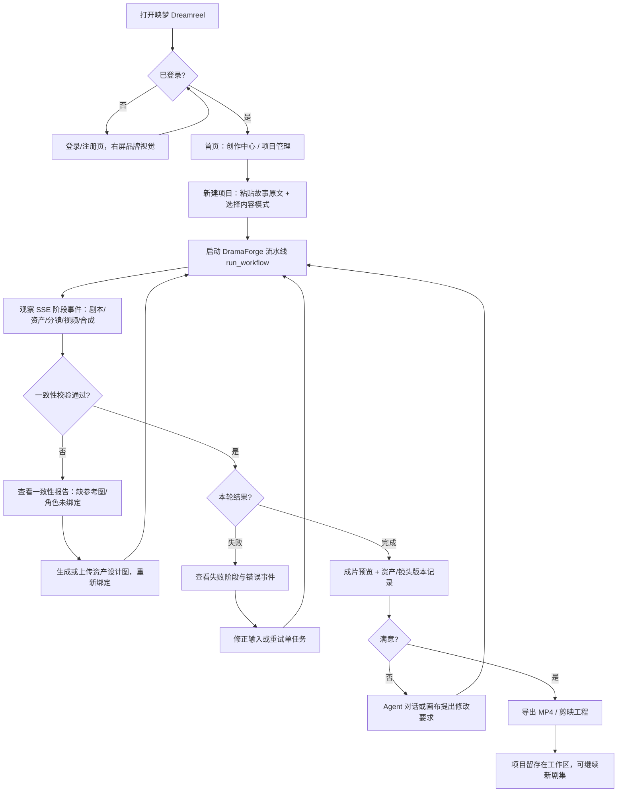
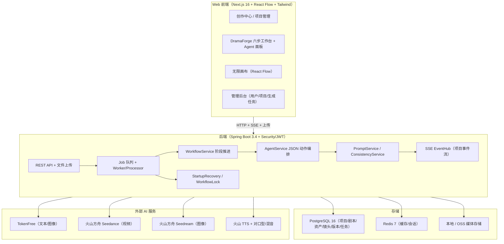
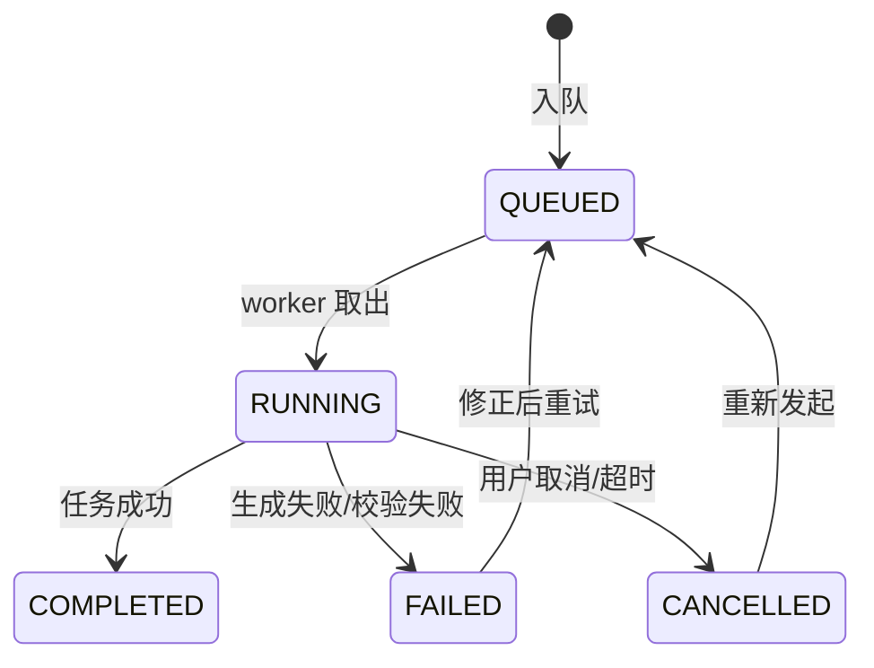
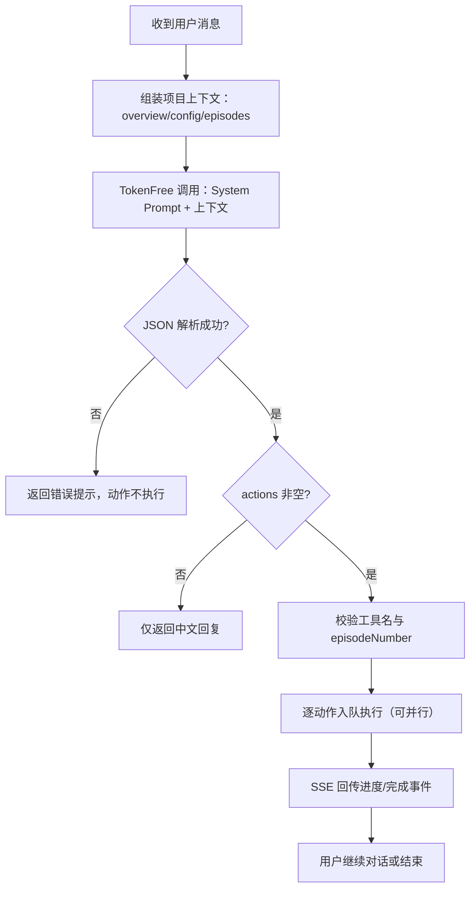
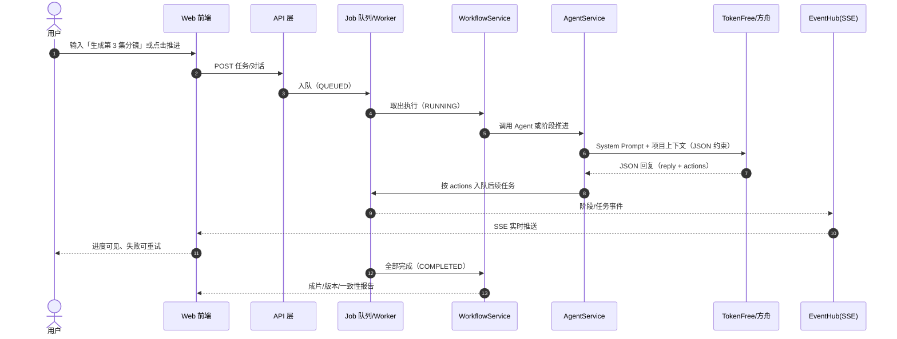

# 映梦 Dreamreel 产品需求文档（PRD）V0.1

---

## 版本修订记录

| 修改时间 | 版本号 | 修改人 | 修改信息 |
| --- | --- | --- | --- |
| 2026-08-21 | V0.1 | 产品团队 | 1. 按「热点内容生成系统」PRD 框架重构输出<br>2. 新增用户流程图、产品架构图（编排 / Loop 拆解）、Agent 编排时序图<br>3. 指标全部带统计口径；能力描述与源码/已验证功能对齐 |

---

## 1 项目背景

微短剧行业正在爆发：国家广电总局数据显示，2025 年有 3.3 万部微短剧上线播出，国内用户近 7 亿，市场规模破千亿元、较 2024 年翻番。与此同时，AI 视频生成已经进入量产成本窗口：火山方舟 Seedance 2.5 的 720P 生成成本约 1.51 元/秒、Seedance 2.0 Mini 约 0.5 元/秒；可灵 AI 2026 年 Q2 单季营收超 8.5 亿元、全球用户突破 1 亿。需求侧与供给侧都验证了「用 AI 做短剧」的真实付费意愿，但现有工具存在明显短板：

- **通用 AI 视频工具只出「片段」，不出「剧」**：文生视频、图生视频、语音、对口型分散在不同产品，剧本 → 资产 → 分镜 → 镜头视频 → 合成导出需要创作者手工串联，单部短剧要跨 5-10 个步骤、3-4 个工具。

- **角色一致性是行业公认「最崩坏的部分」**：社区共识指出每个镜头里角色脸型、光影、服装不一致会让叙事直接崩塌；现有方案（参考图、LoRA、cref）均不够可靠，导致废片率高、反复重试。

- **过程黑盒、失败不可排查**：生成任务排队数小时、进度卡在 99%、失败后不知道卡在哪个阶段，创作者只能盲等或重试。

- **资产与版本不可复用**：角色、场景、道具设计图散落在单个任务里，改一版就要全部重做；镜头与资产没有版本记录，无法回溯「哪一版被最终采用」。

- **多模型切换成本高**：文生图、图生视频、视频生视频、TTS 分别需要不同的 Key、平台和计价体系，普通创作者难以管理。

**要解决的问题**：把「故事 → 剧本 → 资产 → 分镜 → 镜头视频 → 合成导出」的人工串联，压缩为映梦 Dreamreel 内可观察、可溯源、角色一致的 DramaForge 自动化流水线，解决创作链路割裂、角色不连贯、过程不可排查、资产不可复用的问题。

---

## 2 项目目标

### 2.1 产品定位

一站式 AI 短剧创作平台：业务用户通过浏览器即可完成从故事到成片的完整制作，DramaForge 流水线自动编排「写故事 → 定剧本 → 建资产 → 画分镜 → 出成片 → AI 剪辑导出」，无限画布承接节点级二次编辑，全程 SSE 实时可见、资产与镜头版本可溯源。

### 2.2 核心任务

DramaForge 流水线自动化：把「粘贴故事原文 → 提取角色/场景/道具 → 锁定剧本 → 资产定妆 → 分镜 → 镜头视频 → 合成导出（MP4 / 剪映工程）」全流程交给可观察的后台作业自动推进，并支持 Agent 对话式操作、无限画布同步、多模型接入（TokenFree + 火山方舟 Seedance/Seedream + 火山 TTS）、版本激活与一致性校验。

### 2.3 量化指标

| 指标项 | 目标值 | 口径 |
| --- | --- | --- |
| 流水线成功率 | ≥ 80% | 单项目从故事输入到进入 COMPOSED（成片可导出）阶段 |
| 镜头视频生成成功率 | ≥ 70% | 单镜头 SHOT_VIDEO/VIDEO 任务 COMPLETED ÷ 全部生成尝试 |
| 一致性校验覆盖率 | 100% | 每个镜头生成视频前必须执行 ConsistencyService 校验；缺参考图即阻塞并提示 |
| 一致性报告通过率 | ≥ 85% | 项目级一致性报告（角色/场景/道具均有参考图且绑定正确）通过项目数 ÷ 抽样项目数 |
| 事件回传延迟 | ≤ 500ms | 后端事件产生到前端 UI 渲染（SSE 链路） |
| SSE 心跳间隔 | ≤ 15s | 空闲连接心跳，避免被中间层掐断 |
| 版本激活准确率 | 100% | 资产/镜头版本激活后立即生效，version_no 递增且激活记录可查询 |
| 任务恢复成功率 | ≥ 95% | 服务重启后由 StartupRecovery 自动恢复的 RUNNING 任务继续成功完成 |
| 导出成功率 | ≥ 95% | COMPOSE / EXPORT_PROJECT / EXPORT_JIANYING 任务完成 |
| 冷启动性能 | ≤ 3s | Web 首屏可交互（同机 SSD 基准） |
| 构建质量 | 0 告警 | `npm run lint` 0 警告；`npm run test` 全绿；后端 `mvn package` 通过 |
| 密钥安全 | 100% | 日志与事件流中不出现明文 API Key；前端展示一律脱敏 |

---

## 3 目标用户

### 3.1 用户分类

| 用户分类 | 优先级 | 画像特征 | 核心诉求 |
| --- | --- | --- | --- |
| 短剧/漫剧个人创作者 | P0 | 1-5 人；会写故事但不会导演/剪辑；对算力成本敏感 | 从故事直接到成片；角色不串脸；过程看得见；失败可重试 |
| MCN / 短剧工作室 | P0 | 批量做剧、日更或周更；需要多剧集管理与版本管理 | 流水线批量化；资产库复用；导出剪映工程继续精剪 |
| 网文作者 / 编剧 | P1 | 有原创 IP 或改编权；代码与剪辑能力弱 | 一键把小说原文变成分镜与资产；多集联动保持世界观一致 |
| 品牌营销 / 广告团队 | P1 | 做品牌短剧、AI 代言人、信息流广告素材 | 内容模式（drama/narration/ad）可控；快速出片；合规无名人肖像风险 |
| 出海内容团队 | P1 | 面向海外分发；需要多语言与合规标识 | 工程可迁移；备案/标识要求可满足；素材可复用 |
| 平台运营 / 管理员 | P1 | 管理多用户、多项目、算力消耗 | 用户/项目/生成任务统计与审计，异常可追踪 |

### 3.2 用户画像维度

| 用户类别 | 性别 | 年龄 | 职业 | 收入 | 设备 | 核心诉求 |
| --- | --- | --- | --- | --- | --- | --- |
| 短剧个人创作者（P0） | 不限 | 20-35 岁 | 短视频创作者 / 兼职编剧 / 大学生 | 5k-20k/月，随流量波动 | 台式机 + 笔记本，浏览器访问 | 快速出成片；成本可控；角色一致 |
| MCN/工作室（P0） | 不限 | 24-38 岁 | 内容负责人 / 制片 / 后期 | 团队月流水 10w-100w | 高性能台式机 + 团队共享账号 | 批量流水线；版本管理；导出剪映工程 |
| 网文作者/编剧（P1） | 不限 | 22-40 岁 | 作者 / 编剧 | 8k-40k/月 | 笔记本为主 | 原文直接转剧本/分镜；世界观统一 |
| 品牌营销（P1） | 不限 | 24-36 岁 | 内容营销 / 短视频运营 | 月薪 10k-30k | 笔记本 + 手机 | 广告模式模板化；快速迭代；合规 |
| 出海团队（P1） | 不限 | 25-38 岁 | 出海运营 / 制片 | 视项目而定 | 台式机 + 云服务器 | 多语言；标识合规；素材复用 |
| 平台管理员（P1） | 不限 | 25-40 岁 | 运营/技术负责人 | 月薪 15k-40k | 台式机 | 审计统计；任务异常排查 |

---

## 4 使用场景

| 场景 | 频次 | 操作链路 |
| --- | --- | --- |
| 从 0 到 1 做一部短剧 | 每周 | 新建项目 → 粘贴故事原文 → run_workflow 一键推进 → 观察阶段事件 → 修正资产/分镜 → 合成导出 |
| 单集迭代 | 每日 | 打开项目 → 锁定剧本 → 生成/重试单镜头视频 → 查看一致性报告 → 合成该集 |
| 资产复用 | 按需 | 资产库浏览 → 激活历史版本 → 新剧集引用同一角色/场景 → 一致性校验通过 |
| Agent 对话推进 | 每日 | 输入「帮我生成第 3 集分镜」→ Agent 返回 JSON 动作 → 自动入队执行 → SSE 回显进度 |
| 画布二次编辑 | 按需 | 流水线完成后「从流水线同步」→ 画布节点编辑 → 保存回项目 |
| 导出交付 | 每周 | 合成成片 → 导出 MP4 / 剪映工程 → 下载交付给剪辑/分发 |
| 团队/账号管理 | 每周 | 管理员查看用户、项目、生成任务统计 → 审计异常用量 |
| 中英切换 | 按需 | 顶栏切换中文/English → 全站文案与提示切换 |

---

## 5 用户流程图



---

## 6 核心功能

### 6.1 接入与编排

- **DramaForge 六步 SOP**：①写故事 → ②定剧本 → ③建资产 → ④画分镜 → ⑤出成片 → ⑥AI 剪辑导出；后台以 `WORKFLOW_RUN` 任务按当前阶段自动推进下一步（story_input → script_locked → assets_locked → video_done → composed）。

- **作业编排与状态机**：任务类型覆盖 EXTRACT_ASSETS / GENERATE_SCRIPT / ASSET_DESIGN / STORYBOARD / SHOT_VIDEO / VIDEO / COMPOSE / EXPORT_JIANYING 等 14 种；Job 状态 QUEUED → RUNNING → COMPLETED / FAILED / CANCELLED；镜头状态 PENDING → STORYBOARD_DONE → VIDEO_DONE → FAILED。

- **Agent 对话操作**：DramaForge 智能体以 JSON 动作协议（`{"reply":..., "actions":[{"tool":..., "episodeNumber":...}]}`）执行 extract_assets、generate_script、generate_asset_designs、parse_shots、generate_storyboards、generate_videos、compose、run_workflow 等工具，可同时下发多个动作。

- **多模型接入**：TokenFree（文本/图像）、火山方舟 Seedance（文生视频/图生视频）、Seedream（图像）、火山 TTS（角色配音），配套对口型、音频混音与音质重制；API Key 支持本地存储或账号存档，展示一律脱敏。

- **无限画布**：React Flow 节点编辑器，可从流水线一键同步镜头与资产节点（默认同步一集避免画布过载），节点编辑结果可保存回项目。

- **一致性机制**：镜头生成视频前执行 ConsistencyService 校验——角色/场景/道具必须有参考图、绑定正确；支持强制角色绑定（forceCharacterBinding）与可见角色推断，缺图即阻塞并给出中文提示。

### 6.2 过程可视化与溯源

- **SSE 实时进度**：项目级事件通道（30 分钟超时 + 心跳），connected / 心跳 / 各阶段事件实时推送，前端以中文叙事渲染阶段推进与任务状态。

- **失败可见可恢复**：任务失败发布 error 事件并保留阶段信息；服务重启后 StartupRecovery 自动恢复 RUNNING 任务；工作流锁避免并发重复执行。

- **版本溯源**：资产与镜头均带版本表（version_no 递增），可激活历史版本并查询激活记录，成片使用的资产/分镜版本可回溯。

- **一致性报告**：项目级 ConsistencyReport 输出角色/场景/道具绑定结论，作为「能否出成片」的质检门禁。

- **导出产物落库**：合成成片、项目导出包、剪映工程导出均作为可下载产物留存；媒体文件落本地/OSS 存储。

---

## 7 产品架构图

### 7.1 总体产品架构图



**架构要点**：编排与执行分离。API/SSE 层管「任务与事件」，WorkflowService 管「阶段推进」，Job Worker 管「单任务执行」，AgentService 管「模型 ⇄ 工具动作」；三者通过 EventHub 解耦，中间件仅用 PostgreSQL + Redis，可 Docker 全栈一键部署。

### 7.2 编排核心拆解（Workflow / Job）

1. **阶段推进**：`WORKFLOW_RUN` 处理器读取当前 overview.stage()，按 story_input → EXTRACT_ASSETS、script_locked → GENERATE_SCRIPT、assets_locked → ASSET_DESIGN、video_done → VIDEO + SYNC_VIDEOS / COMPOSE 自动入队下一步。

2. **任务互斥与锁**：WorkflowLock 防止同一项目并发重复推进；全局任务由队列 + Worker 顺序消费。

3. **容错语义**：单任务 FAILED 发布 error 事件、阶段可见；StartupRecovery 在服务重启后把遗留 RUNNING 任务恢复为可重试状态。

4. **状态机**：



### 7.3 Agent 执行 Loop（模型 ⇄ 工具动作闭环）



1. **角色 System Prompt**：Agent 固定为「DramaForge 短剧制作智能体」，内置六步 SOP、默认视频路径（分镜图 i2v / 设计图直出）、镜头粒度规则与工具清单。

2. **JSON 契约**：输出必须是 `{"reply": "...", "actions": [...]}` 的合法 JSON，禁止 markdown 代码块；解析失败不执行任何动作并提示用户。

3. **快速指令**：tryQuickAction 识别「第 N 集」等高频指令直接入队，减少一次模型往返。

### 7.4 Agent 编排时序图



---

## 8 交互逻辑

1. **六步工作台联动**：左侧项目与剧集导航，中间六步阶段流（①写故事 → ⑥导出），右侧详情面板；切换项目/剧集后全部同步刷新。

2. **任务状态机**：QUEUED → RUNNING → COMPLETED / FAILED / CANCELLED；失败任务展示阶段与错误，可原地重试或修正后重跑；服务重启后恢复的任务保持原状态流转。

3. **SSE 实时反馈**：事件流以中文叙事渲染（如「正在生成第 3 集镜头视频」），空闲心跳保持连接；断线重连不丢终态。

4. **一致性门禁**：镜头生成前校验弹窗列出阻塞项（如「角色「林晚」缺少设计参考图」）；强制绑定开关用于指定镜头必须使用某角色资产。

5. **版本切换**：资产/镜头详情页展示版本列表，激活任意历史版本即时生效并写激活记录，便于回溯。

6. **Agent 对话面板**：右侧对话区支持自然语言操作；非操作型提问仅返回回复；动作型提问返回即将执行的动作列表，执行结果回显到事件流。

7. **画布同步**：完成流水线后点「从流水线同步」生成节点图（默认单集）；画布支持拖拽、连线、自动保存；未完成流水线时提示先完成资产与镜头。

8. **密钥安全**：API Key 输入框显示脱敏状态；脏粘贴自动清洗（方舟 Key 带时间戳/UUID 前缀）；日志不落明文。

9. **空状态引导**：无项目时展示「新建项目 → 粘贴故事」引导；无 Key 时提示在「API Key 设置」配置，可先看界面演示。

10. **中英切换**：顶栏语言切换，全站文案与错误提示同步切换。

11. **管理审计**：管理员按用户/项目/生成任务查看统计，异常任务可下钻事件流定位。

---

## 9 提示词结构

### 9.1 需求/创意解析 Prompt（剧本与资产提取）

将故事原文压缩为剧本与资产要素，作为后续阶段的输入：

```text
举例：
1. 粘贴一篇 3000 字小说原文
2. 选择内容模式：drama（真人实拍风格）/ narration（写实插画叙事）/ ad（商业广告）
输出 JSON：
{
  "script": { "episodes": [{"episodeNumber": 1, "title": "...", "scenes": [...]}] },
  "assets": [
    {"name": "角色/场景/道具名", "type": "CHARACTER|SCENE|PROP", "description": "..."}
  ]
}
规则：Output ONLY valid JSON；不得捏造原文中不存在的角色与道具；角色名必须与剧本引用一致。
```

### 9.2 分阶段生成 Prompt（对应各阶段 Agent）

**风格提示词（STYLE_SYSTEM）**：输出全剧 AI 生图风格提示词。

```text
#输出要求
1. 只输出最终提示词正文，不要标题、编号、解释、JSON、markdown
2. 80～300 字，中文为主
3. drama 模式必须强调真人实拍、电影摄影、写实肤质、自然光影；严禁漫画、动漫、插画、线稿
4. narration 模式偏写实插画叙事，但仍禁止漫画分格与二次元
5. ad 模式强调商业广告实拍与高质感
6. 包含光影、色调、镜头质感、画质等要素
```

**资产定妆（ASSET_DESIGN_SYSTEM）**：输出纯净参考设计图提示词。

```text
#输出要求
1. 只输出提示词正文，不要解释
2. 角色：虚构半写实数字设定三视图（正面/侧面/背面），纯色棚拍背景，无场景无剧情；随身物三视图必须同款同色同位置
3. 必须声明：虚构角色/CG数字设定稿，非真人照片、非实拍人像、非名人肖像
4. 场景：空镜环境，无人物无动物；道具：单品孤立展示，无人物无手部
5. drama 模式用「半写实棚拍设定卡」；禁止漫画动漫、电影剧照、明星脸描述
6. 150～500 字，强调「纯净参考图」而非剧情画面
```

**镜头提示词（SHOT_SYSTEM）**：优化单镜头完整视频提示词，供规划与 Seedance 生视频共用。

```text
#输出要求
1. 输出须包含：【镜头】动作画面（有角色须含姓名与可辨识外观）；【规划场景】；必要时【运镜】
2. 保留已有【角色线索】【场景线索】【道具线索】中的资产信息，可润色但不得删除角色名
3. drama 为虚构短剧影视单帧，禁止漫画分格、对话框、线稿、真实名人
4. 总长 200～800 字，信息完整，不要只输出一句空话
```

**Agent 系统提示词（DramaForgeAgentService）**：

```text
你是 DramaForge 短剧制作智能体，帮助用户通过对话推进项目。
六步流程（TagoMovie SOP）：①写故事 → ②定剧本 → ③建资产 → ④画分镜 → ⑤出成片 → ⑥AI剪辑导出。
默认视频路径：分镜图 i2v（storyboard_to_video）；高级模式可用设计图直出（reference_to_video）。
镜头粒度：按情节节拍拆镜，一镜一视频；不要把同一段对白拆成多条镜头。
必须严格输出 JSON，不要 markdown 代码块：
{"reply":"给用户的中文回复","actions":[{"tool":"工具名","episodeNumber":1,"text":"可选文本"}]}
若用户只是咨询进度、问问题、不需要执行操作，actions 返回空数组。
```

---

## 10 验收标准

| 编号 | 验收项 | 标准 |
| --- | --- | --- |
| 1 | 流水线成功率 | 单项目从故事输入到 COMPOSED 成功率 ≥ 80% |
| 2 | 镜头视频生成 | 单镜头视频任务成功率 ≥ 70%；失败可单镜头重试 |
| 3 | 一致性校验 | 每个生成视频的镜头均通过校验；缺参考图时阻塞并提示中文原因 |
| 4 | 一致性报告 | 项目级报告正确列出角色/场景/道具绑定状态，通过率 ≥ 85% |
| 5 | SSE 实时性 | 事件从后端产生到 UI 渲染 ≤ 500ms；心跳 ≤ 15s；断线重连不丢终态 |
| 6 | 版本溯源 | 资产/镜头版本可创建、激活、查询激活记录；version_no 严格递增 |
| 7 | 恢复能力 | 模拟重启后 RUNNING 任务自动恢复，恢复成功率 ≥ 95% |
| 8 | 导出 | MP4 与剪映工程导出成功，产物可下载 |
| 9 | Agent 动作 | 对话可触发指定工具入队；JSON 解析失败不执行动作且给出提示 |
| 10 | 画布同步 | 流水线完成后可一键同步节点图并保存；未完成时有明确提示 |
| 11 | 安全 | 日志与事件流无明文 Key；前端 Key 展示脱敏 |
| 12 | 构建质量 | lint 0 警告；`npm run test` 全绿；`mvn package` 通过 |

---

## 11 效果展示

- 产品首页（创作中心）：


- 登录页（右半屏品牌视觉）：


- DramaForge 六步工作台、无限画布、管理后台：截图占位待补充实拍。

---

## 附录 A：PRD 框架提取对照表

| 本 PRD 对应章节 | 映射说明 |
| --- | --- |
| 1 项目背景 | 痛点类比：人工调研 → 人工串联短剧制作链路 |
| 2 项目目标 | 核心任务：热点抓取自动化 → DramaForge 流水线自动化 |
| 3 目标用户 | 用户画像：内容运营 → 短剧/漫剧创作者与工作室 |
| 4 使用场景 | 场景类比：每日抓热点 → 每日单集迭代/批量做剧 |
| 5 用户流程图 | 原文为图片，本版补为 mermaid 流程图（含一致性/失败修正分支） |
| 6.1 接入与编排 | 多平台抓取 → 六步 SOP + Job 编排 + 多模型接入 |
| 6.2 过程可视化与溯源 | 检索溯源 → SSE 事件流 + 版本溯源 + 一致性报告 |
| 7 产品架构图 | 新增：架构总图 + Workflow/Job 拆解 + Agent Loop 拆解 |
| 7.4 Agent 编排图 | 新增：用户 × 流水线 × Agent × SSE 全链路时序图 |
| 8 交互逻辑 | 交互逻辑类比迁移（状态机、门禁、空状态、脱敏） |
| 9 提示词结构 | 提取类 prompt + 分阶段生成 prompt，全部含输出硬约束 |
| 10 验收标准 | 指标类比：成功率 80% / 延迟 / 恢复率 / 安全脱敏 |
| 11 效果展示 | 首页/登录页为实拍截图，其余占位待补充 |
